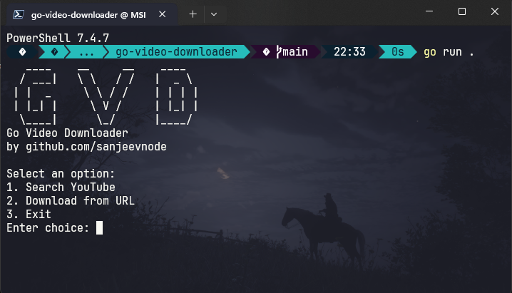

# Go Video Downloader (GVD)

A simple command-line tool to search and download YouTube videos using the YouTube Data API and `yt-dlp`.

## 📦 Features

- Search YouTube videos from your terminal
- Download videos or audio using `yt-dlp`
- Built with Go for speed and simplicity

## Example

Here is a screenshot :



## 🚀 How to Use

### 1. Clone the repository

```bash
git clone https://github.com/sanjeevnode/go-video-downloader.git
cd go-video-downloader
```

### 2. Add your YouTube API key

Create a `.env` file in the root folder:

```ini
YOUTUBE_API_KEY=your_google_api_key_here
```

You can get your API key from: https://console.developers.google.com/ by enabling Youtube Data Api V3

### 3. Run the CLI

```bash
go run main.go
```

### 4. Build for Windows

```bash
go build -o gvd.exe
```

This will generate a Windows executable `gvd.exe` in the current directory.

## ✅ Requirements

- Go 1.18+

## 🧑 Author

**Sanjeev Kumar**  
GitHub: [github.com/sanjeevnode](https://github.com/sanjeevnode)

## 📝 License

Copyright © 2025 Sanjeev Kumar  
This project is licensed under the MIT License.
